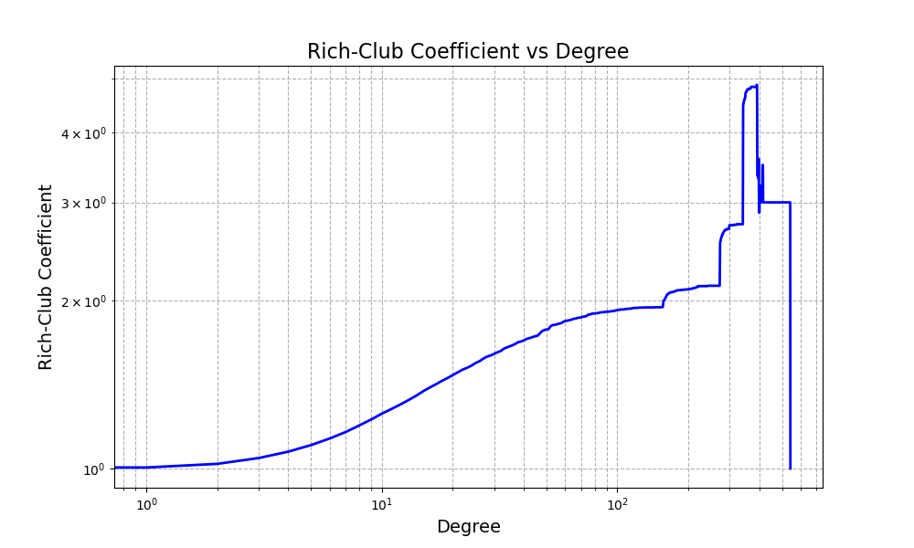
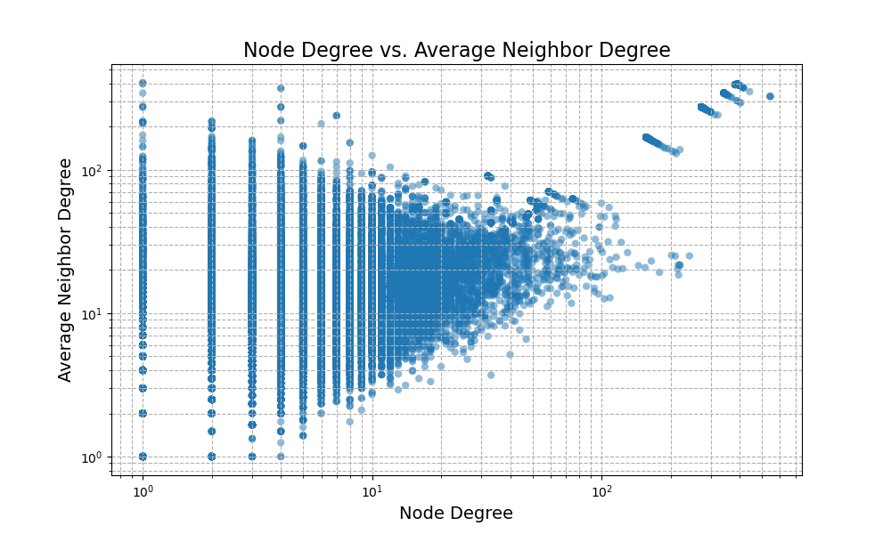

# Complex-Network-Rumor-Spreading-Immunity

## 问题描述

下载https://github.com/marcessz/Twenty-Years-of-Network-Science中的合作者网络，并做如下分析。

1. 分析网络的rich-club特征，并观察其随度的变化趋势。

2. 分析网络的度-度相关特征，可以分别观察节点度与邻居平均度的关系，以及同配性系数的正负。

3. 谣言的传播亦可用病毒传染模型来建模。请使用SIS和SIR模型分别建模该网络上的谣言传播过程，并观察在不同传播参数（感染率，治愈率）下，不同状态所占比例的变化情况。

4. 假如需要采取策略来进行谣言的“阻断”（辟谣），以SIS模型为例，比较随机策略、目标策略和熟人策略的优劣。注意，可以先在网络中对相同数目的节点进行“阻断”（将被辟谣节点移除），再观察SIS模型仿真结果的变化。

## 分析与代码实现

```python
import pandas as pd
import networkx as nx
import matplotlib.pyplot as plt
import numpy as np
import EoN

def load_network(file_path):
    # Load the edge list from the Excel file
    edge_list_path = file_path
    edge_list_df = pd.read_excel(edge_list_path)

    # Create a graph from the edge list
    # G = nx.from_pandas_edgelist(edge_list_df, source='source', target='target')
    
    G = nx.from_pandas_edgelist(edge_list_df, source='source', target='target')

    # Display basic information about the network to confirm successful loading
    network_info = {
        "Number of Nodes": G.number_of_nodes(),
        "Number of Edges": G.number_of_edges(),
        "Is the Network Directed": nx.is_directed(G)
    }
    
    print(network_info)
    
    return G

def rich_club(G):
    # Calculate the rich-club coefficient for the network
    rich_club_dict_small = nx.rich_club_coefficient(G, normalized=True, Q=100)
    degrees_small, coefficients_small = zip(*rich_club_dict_small.items())

    # Plot the rich-club coefficient for the smaller network
    plt.figure(figsize=(10, 6))
    plt.plot(degrees_small, coefficients_small, 'b-', lw=2)
    plt.xscale('log')
    plt.yscale('log')
    plt.xlabel('Degree', fontsize=14)
    plt.ylabel('Rich-Club Coefficient', fontsize=14)
    plt.title('Rich-Club Coefficient vs Degree', fontsize=16)
    plt.grid(True, which="both", ls="--")
    plt.savefig('./Images/rich_club.png')
    plt.close()

def degree_to_degree_correlation(G):
    # Calculate the average neighbor degree for each node in the smaller network
    avg_neighbor_deg_small = nx.average_neighbor_degree(G)

    # Calculate the degree of each node in the smaller network
    node_degrees = dict(G.degree())

    # Prepare data for plotting
    degrees = np.array(list(node_degrees.values()))
    avg_neighbors_deg = np.array(list(avg_neighbor_deg_small.values()))

    # Calculate degree assortativity coefficient of the smaller network
    assortativity_coefficient = nx.degree_assortativity_coefficient(G)

    # Plotting
    plt.figure(figsize=(10, 6))
    plt.scatter(degrees, avg_neighbors_deg, alpha=0.5, edgecolor='none')
    plt.xscale('log')
    plt.yscale('log')
    plt.xlabel('Node Degree', fontsize=14)
    plt.ylabel('Average Neighbor Degree', fontsize=14)
    plt.title('Node Degree vs. Average Neighbor Degree', fontsize=16)
    plt.grid(True, which="both", ls="--")
    print(assortativity_coefficient)
    plt.savefig('./Images/node_degree.png')
    plt.close()

def simulate_epidemic(G, model='SIS', initial_infecteds=0.05, beta=0.9, gamma=0.01, tmax=50):
    """
    Simulate an epidemic (SIS or SIR model) on a network using EoN library.

    Parameters:
    - G: NetworkX graph
    - model: 'SIS' or 'SIR', the epidemic model to simulate
    - initial_infecteds: fraction or count of initially infected nodes
    - beta: infection rate
    - gamma: recovery rate
    - tmax: maximum simulation time

    Returns:
    - t: numpy array of times
    - S: numpy array of susceptible counts over time
    - I: numpy array of infected counts over time
    - R: numpy array of removed counts over time (only for SIR model)
    """
    N = G.number_of_nodes()
    initial_infecteds = int(N * initial_infecteds)
    if model == 'SIS':
        t, S, I = EoN.fast_SIS(G, tau=beta, gamma=gamma, tmax=tmax, 
                              initial_infecteds=initial_infecteds, return_full_data=False)
        save_simulation_results(t=t, S=S, I=I, filename_prefix = './Images/SIS/simulation_beta'+'{:.2f}'.format(beta)+'gamma_'+'{:.2f}'.format(gamma))
        return t, S, I, None
    elif model == 'SIR':
        t, S, I, R = EoN.fast_SIR(G, tau=beta, gamma=gamma, tmax=tmax, 
                                  initial_infecteds=initial_infecteds, return_full_data=False)
        save_simulation_results(t=t, S=S, I=I, R=R, filename_prefix = './Images/SIR/simulation_beta'+'{:.2f}'.format(beta)+'gamma_'+'{:.2f}'.format(gamma))
        return t, S, I, R

def simulate_intervention(G, strategy='random', fraction=0.1, beta=0.03, gamma=0.01, tmax=50):
    """
    Simulate an epidemic (SIS model) on a network with intervention strategies.

    Parameters:
    - G: NetworkX graph
    - strategy: 'random', 'targeted', or 'acquaintance', the intervention strategy
    - fraction: fraction of nodes to be removed/immunized
    - beta: infection rate
    - gamma: recovery rate
    - tmax: maximum simulation time

    Returns:
    - t: numpy array of times
    - S: numpy array of susceptible counts over time
    - I: numpy array of infected counts over time
    """
    N = G.number_of_nodes()
    num_to_remove = int(N * fraction)
    G_modified = G.copy()
    
    if strategy == 'random':
        nodes_to_remove = np.random.choice(G.nodes(), size=num_to_remove, replace=False)
    elif strategy == 'targeted':
        nodes_to_remove = sorted(G.degree(), key=lambda x: x[1], reverse=True)[:num_to_remove]
    elif strategy == 'acquaintance':
        nodes_to_remove = set()
        while len(nodes_to_remove) < num_to_remove:
            node = np.random.choice(list(G.nodes()))
            if G.degree(node) > 0:
                neighbor = np.random.choice(list(G.neighbors(node)))
                nodes_to_remove.add(neighbor)
    
    G_modified.remove_nodes_from(nodes_to_remove)
    
    # Simulate SIS model on the modified graph
    t, S, I, _ = simulate_epidemic(G_modified, model='SIS', initial_infecteds=0.05, 
                                   beta=beta, gamma=gamma, tmax=tmax)
    save_simulation_results(t=t, S=S, I=I, filename_prefix = './Images/' + strategy + 'SIS_simulation')
    
    return t, S, I


def save_simulation_results(t, S, I, R=None, filename_prefix='./Images/simulation'):
    """
    Save simulation results to CSV and plot results.
    """
    # 将结果保存为DataFrame
    data = {'t': t, 'S': S, 'I': I}
    if R is not None:
        data['R'] = R
    df = pd.DataFrame(data)
    
    # 保存为CSV文件
    csv_filename = f'{filename_prefix}.csv'
    df.to_csv(csv_filename, index=False)
    print(f'Results saved to {csv_filename}')
    
    # 绘制结果并保存图片
    plt.figure()
    plt.plot(t, S, label='Susceptible')
    plt.plot(t, I, label='Infected')
    if R is not None:
        plt.plot(t, R, label='Recovered')
    plt.xlabel('Time')
    plt.ylabel('Fraction of Population')
    plt.legend()
    figure_title = filename_prefix.split('/')[-1]
    plt.title(f'{figure_title} Results')
    
    # 保存图片
    img_filename = f'{filename_prefix}.png'
    plt.savefig(img_filename)
    plt.close()
    print(f'Results plot saved to {img_filename}')

def main():
    edge_list_path = './Twenty-Years-of-Network-Science/edge-list/twenty_years_edgelist.xlsx'
    G = load_network(file_path = edge_list_path)
    # rich_club(G)
    # degree_to_degree_correlation(G)
    for beta in np.arange(0.05, 1, 0.05):
        for gamma in np.arange(0.05, 1, 0.1):
            simulate_epidemic(G, beta = beta, gamma = gamma)
            simulate_epidemic(G = G, model = 'SIR', beta = beta, gamma = gamma)
    simulate_intervention(G)
    simulate_intervention(G, strategy = 'targeted')
    simulate_intervention(G, strategy = 'acquaintance')

if __name__ == '__main__':
    main()
```


## 结果与讨论

### Rich-Club



"Rich-club"现象指的是网络中高度节点倾向于互相连接，形成一个紧密相连的核心小团体。"Rich-club"系数是量化这种现象的一个指标，在上图中，横坐标是节点的度（对数尺度），纵坐标是“rich-club”系数（也是对数尺度）。从图中可以看出，随着度的增加，“rich-club”系数先是缓慢上升，随后在特定的度值范围内急剧上升，之后又有所下降，然后在更高的度值处再次急剧上升。这可能意味着网络中存在一个度值范围，在范围内，高度的节点很互相连接。

在度较低时，“rich-club”系数较小，表明低度节点之间没有特别强的互连趋势。随着度的增加，系数开始上升，表明随着节点连接数的增加，它们互相连接的可能性也在增加。在某个特定度值范围内出现的急剧上升表示网络中有一个明显的“rich-club”区域，即高度节点倾向于形成一个紧密相连的群体。系数的下降表明超过某个度值后，再增加连接数对于提高“rich-club”系数的贡献减少。

### 度度相关性



同配性系数：0.9807135015561302

同配性系数为0.9807135015561302，这是一个非常接近1的正值，表明网络具有很强的同配性。这意味着网络中的节点确实倾向于与度类似的其他节点连接。这样的网络可能具有强烈的社群结构，高度节点彼此连接形成了一个紧密的核心。

在这张图中，横坐标是节点度（对数尺度），纵坐标是平均邻居度（对数尺度）。从图中可以观察到以下特点：

- 在度较低的区域，平均邻居度的散点较为分散，这表明低度节点的邻居度可能高度变化。
- 当节点度增加时，平均邻居度有下降的趋势。这种趋势在很多网络中被观察到，称为度-度负相关。
- 然而，在某些高度值处，可以看到平均邻居度也很高，这可能表明网络存在一些高度节点相互连接的小团体，这与“rich-club”现象相一致。

根据这幅图和提供的同配性系数，可以认为网络表现出了强烈的同配性，即高度节点倾向于与其他高度节点相连。然而，低度节点的连接模式则可能更为复杂和多变。

### SIS & SIR

#### SIS


上图是SIS（Susceptible-Infected-Susceptible）模型的模拟结果矩阵。在这种模型中，每个个体在“易感染”(Susceptible)和“感染”(Infected)状态之间转换。感染率（β）决定了易感个体变成感染个体的速率，而治愈率（γ）决定了感染个体恢复到易感状态的速率。

每行展示的是相同感染率（β）下的不同治愈率（γ）对模型影响的图表，而每列展示的是在相同治愈率下不同感染率的影响。每张小图显示的是从初始状态到50天内的感染动态。橙色曲线表示感染者的比例，蓝色曲线表示易感者的比例。

通过分析这些图表，我们可以观察以下趋势：

- 低感染率，高治愈率（左上角的图表）：感染者比例很快减少，趋于零或很低的稳态。这表示谣言很快就会停止传播。
- 高感染率，低治愈率（右下角的图表）：感染者比例迅速上升并在高值处稳定，意味着谣言持续广泛传播。
- 高感染率，高治愈率：感染者比例上升后可能会达到某个平衡点，反映出谣言虽然快速传播但也有相应的高治愈率使其不会占据整个网络。
- 低感染率，低治愈率：感染者比例缓慢上升或达到较低的平衡状态，表示谣言传播缓慢，且不会迅速消失。

#### SIR


上图是SIR（Susceptible-Infected-Recovered）模型的模拟结果矩阵。与SIS模型不同，SIR模型包括三个状态：易感染(Susceptible)、感染(Infected)、移除(Recovered)。在SIR模型中，个体从易感状态变为感染状态，然后进入移除状态，移除状态的个体不再参与传播过程。感染率(β)仍然表示易感个体变成感染个体的速率，而移除率(γ)则表示感染个体变为移除状态的速率。

每行展示的是相同感染率(β)下不同移除率(γ)对模型影响的图表，每列展示的是在相同移除率下不同感染率的影响。每张小图代表特定的β和γ值组合下的50天内动态变化。在这些图中，橙色曲线代表感染者的比例，蓝色曲线代表易感者的比例，绿色曲线代表移除者的比例。

根据SIR模型的这些结果，我们可以分析以下趋势：

- 低感染率，高移除率（左上角的图表）：感染者比例迅速增加后快速减少，最终趋于零，这表明谣言不会持续太长时间。
- 高感染率，低移除率（右下角的图表）：感染者比例迅速增加并保持在一个较高的水平，然后缓慢下降，这表示谣言广泛传播并持续较长时间。
- 高感染率，高移除率：感染者比例迅速上升后下降，最终易感者变少，移除者比例增加，表明谣言传播速度快但是也很快就结束了。
- 低感染率，低移除率：感染者比例缓慢增加，移除者比例逐渐增加，表明谣言传播慢，但是传播时间较长。

### 传播阻断


基于上图结果，比较三种不同的“阻断”策略：随机策略、目标策略和熟人策略。

1. 随机策略(Random Strategy):

- 在这种策略中，随机选定节点进行阻断。
- 从仿真图可以看出，易感人群的比例逐渐下降，感染人群的比例则逐渐上升，但这种增长的速度相对较慢。
- 这表明虽然阻断有一定的效果，但由于缺乏针对性，使得谣言的传播速度只是被稍微延缓。

2. 目标策略(Targeted Strategy):

- 这种策略涉及优先阻断网络中的关键节点（例如那些具有高度的节点）。
- 仿真图显示，采取目标策略后，易感人群的比例保持在很高的水平，而感染人群的比例迅速下降到几乎为零。
- 这表明目标策略非常有效，因为它直接中断了谣言传播的主要途径。

3. 熟人策略(Acquaintance Strategy):

- 在熟人策略中，通过网络中随机选定的节点的邻居进行阻断，这是基于“熟人的熟人很可能是中心人物”的假设。
- 仿真结果显示，这种策略也能有效减缓谣言的传播，易感人群的比例略有下降，而感染人群的比例上升速度慢于随机策略。
- 这意味着熟人策略比随机策略更有效，但可能不如目标策略有效。

根据仿真结果，目标策略是最有效的，因为它能迅速减少感染人数，保持一个高的S人群比例。熟人策略次之，因为它在一定程度上利用了网络的结构信息来更有针对性地选择阻断的节点。随机策略虽然有一定效果，但由于缺乏针对性，因此是三种策略中效果最差的。